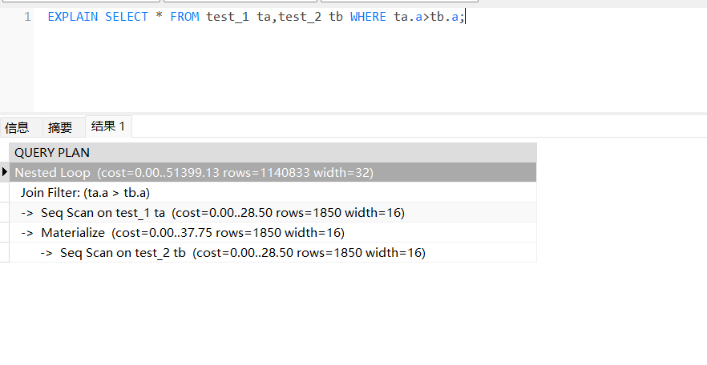
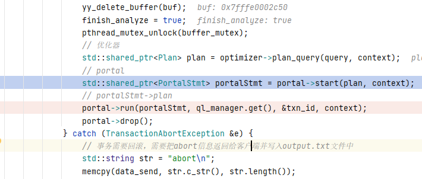
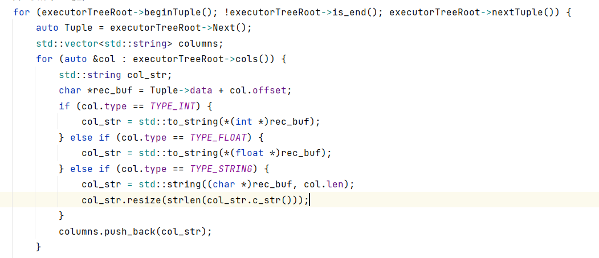

## 系统结构

### ColMeta

在sm_meta中，包含了一列的元信息（注意是没有具体的数据的）

```C++
struct ColMeta {
    std::string tab_name;   // 字段所属表名称
    std::string name;       // 字段名称
    ColType type;           // 字段类型
    int len;                // 字段长度
    int offset;             // 字段位于记录中的偏移量
    bool index;     
}
```

### TabMeta

包含了表的元信息。

```C++
struct TabMeta {
    std::string name;                   // 表名称
    std::vector<ColMeta> cols;          // 表包含的字段
    std::vector<IndexMeta> indexes; 
}
```

### TabCol

在`common.h` 中，只有表的名字和该列的名字

```C++
struct TabCol {
    std::string tab_name;
    std::string col_name;

    friend bool operator<(const TabCol &x, const TabCol &y) {
        return std::make_pair(x.tab_name, x.col_name) < std::make_pair(y.tab_name, y.col_name);
    }
};
```

## Executor结构

### AbstractExecutor

包含rid，指示这次执行应该取出的rid。


```C++
Rid _abstract_rid;

Context *context_;
```

**Context**

包含了所用的lock manager, log manager。还有此次的事务信息。

```C++
class Context {
public:
    Context (LockManager *lock_mgr, LogManager *log_mgr, 
            Transaction *txn, char *data_send = nullptr, int *offset = &const_offset)
        : lock_mgr_(lock_mgr), log_mgr_(log_mgr), txn_(txn),
          data_send_(data_send), offset_(offset) {
            ellipsis_ = false;
          }

    // TransactionManager *txn_mgr_;
    LockManager *lock_mgr_;
    LogManager *log_mgr_;
    Transaction *txn_;
    char *data_send_;
    int *offset_;
    bool ellipsis_;
};
```

### Seq Scan

这里我首先需要做判断工作。

```C++
auto left_col = get_col(cols_,condition.lhs_col); // 首先根据condition中，左侧列的名字，来获取该列的数据
char* l_value = rec->get()->data+left_col->offset; // 获得左值。CHECK(AntiO2) 这里左值一定是常量吗？有没有可能两边都是常数。
char* r_value;
ColType r_type{};
if(condition.is_rhs_val) {
    // 如果右值是一个常数
    r_value = condition.rhs_val.raw->data;
    r_type = condition.rhs_val.type;
} else {
    // check(AntiO2) 这里只有同一张表上两个列比较的情况吗？
   auto r_col =  get_col(cols_,condition.rhs_col);
   r_value = rec->get()->data + r_col->offset;
   r_type = r_col->type;
}
assert(left_col->type==r_type); // 保证两个值类型一样。
return evaluate_compare(l_value, r_value, r_type, left_col->len, condition.op); 
```

这里我首先获取了tuple中的左值，然后通过与右值比较来获取condition是否为真。

这里引出了一个问题：如果是比较两张表上的列呢。

实际上，只可能在一个record(该rec可能不是在表上存在的)上进行比较。



参照PostgreSQL，可以将两个表的比较断言变成join条件，或者是在Join之上加一个filter。总之先不要在这里焦虑这个问题了

### Update

```C++
case T_Update:
{
    std::unique_ptr<AbstractExecutor> scan= convert_plan_executor(x->subplan_, context);
    std::vector<Rid> rids;
    for (scan->beginTuple(); !scan->is_end(); scan->nextTuple()) {
        rids.push_back(scan->rid());
    }
    std::unique_ptr<AbstractExecutor> root =std::make_unique<UpdateExecutor>(sm_manager_, 
                                            x->tab_name_, x->set_clauses_, x->conds_, rids, context);
    return std::make_shared<PortalStmt>(PORTAL_DML_WITHOUT_SELECT, std::vector<TabCol>(), std::move(root), plan);
}


```

在portal中的start中，可以看到update**是先执行子算子**， 然后获取rid，再通过rid进行更新操作。（感觉这种方式有点蠢，需要读取两次tuple。应该将子算子作为Update Executor）


再看一下是怎么执行DML的，居然是直接一个Next(),那就是说Insert,Update,Delete都是一次性执行完了。

```C++
void QlManager::run_dml(std::unique_ptr<AbstractExecutor> exec){
    exec->Next();
}
```

## 如何执行？



在一次语句执行前，首先调用portabl.start将执行计划转百年为算子数。然后调用run方法进行执行。

按照执行DQL举例，首先执行管理器调用beginTuple()进行初始化（相当于一个迭代器），然后每次通过Next()获取一个tuple。Next()本身不会将迭代器后移。



### Join

